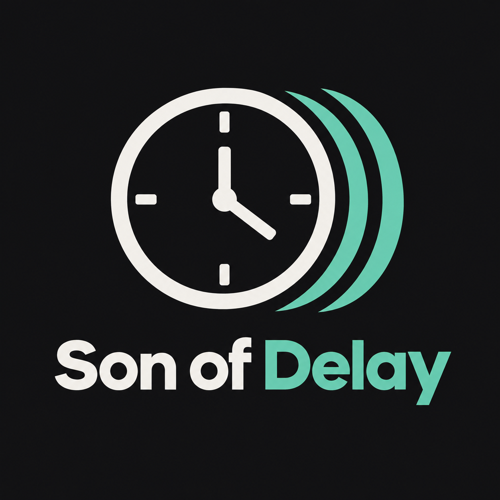

# Son of Delay



一款以“操控行动延迟”为主题的 2D 横版动作 Game Jam 原型。

项目在 2026 年的 Godot Game Jam 截止前提交。当前版本已经具备从主菜单、线性教学、正式关卡到胜负结算的完整流程，但关卡、美术、音乐与音效均未达到正式成品标准。仓库公开的主要目的，是保存这次机制实验、工程实现与设计复盘，而不是将其描述成一款已经完成的游戏。

> **项目状态：原型完成，现已停止主动开发。**
>
> 程序代码保持 Game Jam 最终版本的玩法结构；公开整理只修订了设计文档、仓库说明和许可证，并清理了未使用的空白文件。

## 核心概念

玩家、敌人、弹体和部分机关都可以拥有独立的行动延迟。正延迟不会简单降低对象速度，而是先记录命令，再经过指定时间回放。

玩家默认拥有 1 秒自然延迟。为了避免按键后完全没有反馈，玩家同时由三份角色状态协作：

- **Body**：权威本体，负责真实碰撞、伤害、拾取和结算。
- **PreviewBody**：蓝色即时预览体，在正延迟存在时先响应玩家输入。
- **Predictor**：隐藏预测器，在思考时间内模拟修改延迟后的可能结果。

按空格进入“思考时间”后，世界暂停。玩家可选择自身、敌人或机关，预览并提交新的延迟。调整受两种资源限制：

- **时滞能量**：向更高负载方向调整时消耗，会随时间恢复。
- **延迟负载**：记录所有对象偏离自然延迟所占用的持续容量。

玩家蓄力或敌人特定动作进行中，还可以在普通延迟已经归零后投入负载，让当前动作获得一次性的“负延迟”加速。它是动作级快进，不是整条时间线倒流。

## 已实现内容

- 主菜单、音量与全屏设置、暂停菜单。
- 包含 17 个步骤的线性教学关卡。
- 一条横版正式关卡，包含清场、终点、胜利、战败和重生流程。
- 剑、回旋镖、直射法杖三种武器。
- 近战敌人、远程敌人及可延迟的敌人行为。
- 移动平台、升降门、压力开关、尖刺和坠落机关。
- 玩家、敌人、弹体与机关的命令缓冲和延迟回放。
- 思考时间预测、历史时间切片、预测分歧闪回。
- 普攻连段、蓄力攻击、动作输入缓冲、受击顿帧、镜头震动和屏幕闪光。
- 14 个针对战斗、教学、武器、机关、相机和延迟资源的无头测试脚本。

## 运行项目

### 环境

- Godot Engine 4.7
- 渲染器：Forward Plus
- 建议分辨率：1280 × 720

### 启动

1. 克隆或下载仓库。
2. 打开 Godot Project Manager。
3. 导入 [`program/project.godot`](program/project.godot)。
4. 运行项目；入口场景为主菜单。

仓库包含 Windows 与 Web 导出预设，但不跟踪本地 `build/` 导出结果。

## 操作

| 操作 | 按键 |
| --- | --- |
| 左右移动 | `A` / `D` |
| 跳跃 | `W` |
| 下穿薄平台 | `S` |
| 瞄准 | 鼠标 |
| 普通攻击 / 释放蓄力 | 鼠标左键 |
| 进入或取消蓄力 | 鼠标右键 |
| 拾取武器 | `F` |
| 切换已解锁武器 | `1` / `2` / `3` |
| 进入或提交思考时间 | `Space` |
| 思考时间内微调目标延迟 | 鼠标滚轮 |
| 思考时间内快速预设 | `1` / `2` / `3` / `R` / `Q` / `E` |
| 非思考时间快速调整自身 | `Q` / `E` |
| 暂停 / 返回 | `Esc` |

完整规则会在教学关卡内依次说明。

## 技术结构

延迟系统统一按 100 Hz 逻辑基准记录和消费帧，不依赖当前世界播放速度。

- `DelayControllerBase`：可延迟对象的公共生命周期、延迟 UI 和资源接口。
- `DelayedActorGroup`：玩家三体结构、分歧闪回、动作加速与武器同步。
- `CommandReplayDelayController`：敌人和机关复用的命令回放适配层。
- `DelayTimelineBuffer` / `DelayCommandBuffer`：固定容量环形缓冲与读写头管理。
- `PreviewSystem` / `DelayPredictionRunner`：玩家历史记录和思考时间逐帧预测。
- `TimeSliceSystem`：历史轨迹、预测轨迹与延迟变化的可视化。
- `WorldTimeAuthority`：思考时间、慢动作、顿帧、镜头震动和外部暂停的统一入口。
- `DelayBudgetManager`：延迟请求的容量准入、能量消耗和统一提交。

## 查看设计文档

更详细的机制结构和早期设计草案位于 [`Design/`](Design/) 目录。这些文档使用 Obsidian Canvas 的 `.canvas` 格式，不是普通图片，也不能直接用 Godot 打开。

查看方法：

1. 安装并启动 [Obsidian](https://obsidian.md/)。
2. 在 Obsidian 中选择“打开本地仓库”。
3. 选择本项目的 `Design` 文件夹作为仓库目录。
4. 在左侧文件列表中双击任意 `.canvas` 文件，即可查看节点、文本和连线。

`.canvas` 文件本质上是 JSON 文本，因此 GitHub 和 Gitee 可以展示原始内容，但要查看正常的可视化布局，建议使用 Obsidian 打开。设计目录内另有一份单独的[查看说明](Design/README.md)。

## 测试

测试脚本位于 [`program/test/`](program/test/)，多数可通过 Godot 命令行单独执行。例如：

```powershell
godot --headless --path program --script res://test/combat_room_test.gd
godot --headless --path program --script res://test/tutorial_level_test.gd
```

这些脚本是 Jam 开发过程中的回归测试，不代表项目已经过完整兼容性或发布质量验证。

## 设计复盘

这次原型成功证明了“独立对象命令延迟 + 即时预览 + 时间线预测”在技术上可以实现，也意外形成了一些有趣的组合，例如玩家拥有额外延迟负载时，通过蓄力、快速归零和动作加速迅速释放高阶攻击。

但实际试玩也暴露了核心问题：

- 自身延迟首先削弱的是操作与反馈之间的直接联系。
- 即使有蓝色预览体，真实本体迟到仍会产生明显负反馈。
- 当玩家可以自由选择时，把自身延迟设为 0 通常是最舒适也最直接的策略。
- 给敌人增加延迟虽然有效，但体验容易接近减速、冻结或眩晕等已有能力。
- 正式关卡主要验证功能，没有围绕延迟机制进行足够精细的空间与战斗设计。
- 相比核心延迟，普攻连段、蓄力、顿帧、击退和镜头反馈反而更能提供即时乐趣。

因此项目最终被保留为一次机制验证，而没有继续扩展剧情、关卡和美术。这里的结论不是“延迟绝对不能成为好玩法”，而是它没有通过作者个人兴趣与当前原型体验的验证。对个人开发而言，持续创作动力与机制潜力同样重要。

这次实验留下的主要经验是：下一次应先用一个房间、一个敌人和一种武器验证 30 秒战斗循环，确认核心操作本身足够吸引人，再扩展系统架构和内容规模。

## 美术、音频与 AI 协作说明

- 当前角色、敌人、机关和战斗表现主要由 Godot 节点、图元、Shader 与脚本程序化生成，没有正式角色美术资源。
- 当前版本没有实际音乐和音效资源。
- 项目图标与临时封面由生成式 AI 临时生成，仅用于 Game Jam 提交和仓库识别，不承载剧情或设定含义。
- 开发过程中大量使用 OpenAI Codex 协助编程、调试、测试和程序化表现实现；玩法方向、取舍、测试与最终发布责任由作者承担。

## 仓库结构

```text
Design/    Obsidian Canvas 设计草案与最终机制结构
program/   Godot 工程、场景、脚本、资源与测试
licenses/  第三方资源许可证
```

## 许可证

- `program/` 中的原创源代码（第三方内容除外）采用 [MIT License](LICENSE)。
- `program/SmileySans-Oblique.otf` 为得意黑字体，采用 SIL Open Font License 1.1；详见 [第三方声明](THIRD_PARTY_NOTICES.md)。
- `Design/` 中的设计文档、项目图标和图片不包含在 MIT 软件许可证中，版权归其各自权利人所有，仅随本仓库用于项目说明与展示。

如果你希望复用代码，请同时检查具体文件是否引用了第三方资源及其独立许可。
